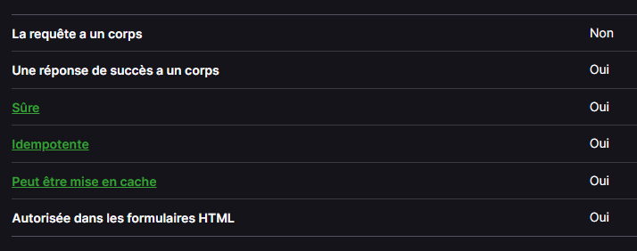
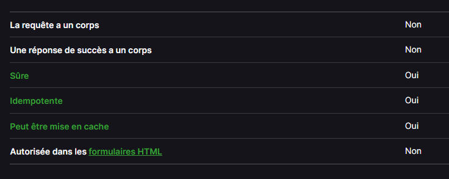
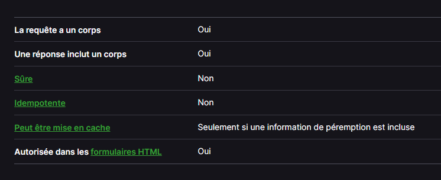
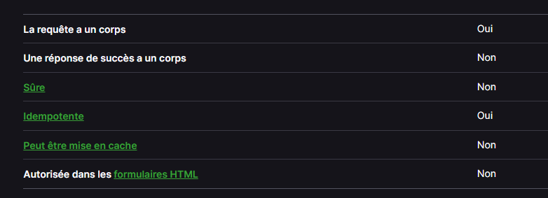
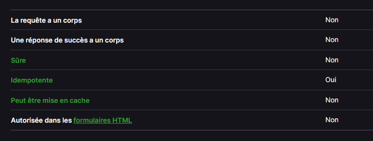
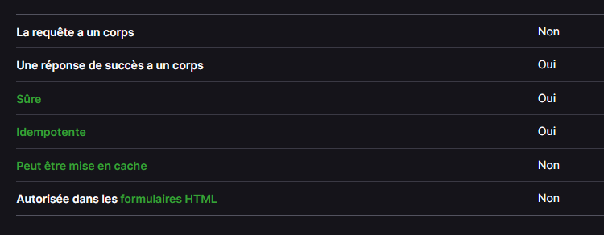
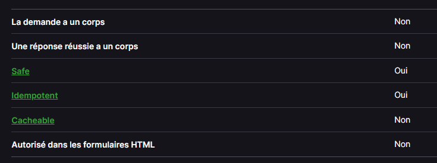
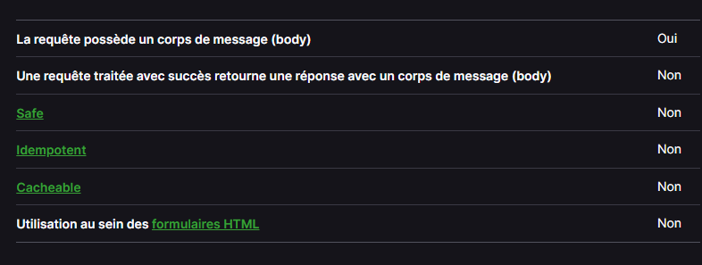

# **Méthodes de requête HTTP**

HTTP définit un ensemble de méthodes de requête qui indiquent l'action que l'on souhaite réaliser sur la ressource indiquée. Bien qu'on rencontre également des noms (en anglais), ces méthodes sont souvent appelées verbes HTTP. Chacun d'eux implémente une sémantique différente mais certaines fonctionnalités courantes peuvent être partagées par différentes méthodes (e.g. une méthode de requête peut être sûre (safe), idempotente ou être mise en cache (cacheable)).
### **Définition**

</br></br>


## I - **Méthode GET** ##
***
``` http
GET
La méthode GET demande une représentation de la ressource spécifiée. Les requêtes GET doivent uniquement être utilisées afin de récupérer des données.
```
- syntaxe
``` http
GET /index.html
```

</br></br>


## II - **Méthode HEAD** ##
***
La méthode HTTP HEAD demande les en-têtes qui seraient retournés si la ressource spécifiée était demandée avec une méthode HTTP GET. Une telle requête peut être envoyée avant de procéder au téléchargement d'une ressource volumineuse, par exemple pour économiser de la bande passante.

Une réponse issue d'une requête HEAD ne doit pas avoir de corps. Si tel est le cas, elle doit être ignorée. Toutefois, les en-têtes d'entité décrivant le contenu du corps, comme Content-Length, peuvent être inclus dans la réponse. Ils ne sont pas liés au corps de la réponse HEAD , qui doit être vide, mais au corps d'une réponse issue d'une requête similaire utilisant la méthode GET.

Si le résultat d'une requête HEAD montre qu'une ressource mise en cache après une requête GET est désormais dépassée, le cache est invalidé, même si aucune requête GET n'a été émise.
``` http
HEAD
La méthode HEAD demande une réponse identique à une requête GET pour laquelle on aura omis le corps de la réponse (on a uniquement l'en-tête).
```
- syntaxe
``` http
HEAD /index.html
```



</br></br>


## III - **Méthode POST** ##
***
La méthode HTTP POST envoie des données au serveur. Le type du corps de la requête est indiqué par l'en-tête Content-Type.

La différence entre PUT et POST tient au fait que PUT est une méthode idempotente. Une requête PUT, envoyée une ou plusieurs fois avec succès, aura toujours le même effet (il n'y a pas d'effet de bord). À l'inverse, des requêtes POST successives et identiques peuvent avoir des effets additionnels, ce qui peut revenir par exemple à passer plusieurs fois une commande.

Une requête POST est habituellement envoyée via un formulaire HTML et a pour résultat un changement sur le serveur. Dans ce cas, le type du contenu est sélectionné en mettant la chaîne de caractères adéquate dans l'attribut enctype de l'élément <'form'> ou dans l'attribut formenctype de l'élément <'input'>, voir celui des éléments <'button'> :
 - application/x-www-form-urlencoded : les valeurs sont encodées sous forme de couples clé-valeur séparés par '&', avec un '=' entre la clé et la valeur. Les caractères non alphanumériques sont percent encoded : c'est la raison pour laquelle ce type de format n'est pas adapté à une utilisation avec des données binaires (utilisez multipart/form-data à la place)
- multipart/form-data
- text/plain

Lorsque la requête POST est envoyée par un autre moyen qu'un formulaire HTML, par exemple via XMLHttpRequest, le corps peut être de n'importe quel type. Comme décrit dans la spécification HTTP 1.1, la méthode POST est conçue pour permettre une méthode uniforme couvrant les fonctions suivantes :

- Annotation de ressources existantes
- Publication d'un message sur un tableau d'affichage, un groupe de discussion, une liste de diffusion, ou un groupe similaire d'articles;
- Apport d'un bloc de données, tel que le résultat produit par la soumission d'un formulaire, à un processus de traitement de données;
- Extension d'une base de données au travers d'une opération d'ajout.
``` http
POST
La méthode POST est utilisée pour envoyer une entité vers la ressource indiquée. Cela entraîne généralement un changement d'état ou des effets de bord sur le serveur.
```
**SYNTAXE**
``` http
POST /index.html
```
**EXEMPLE**

- Un formulaire simple utilisant le type de contenu par défaut application/x-www-form-urlencoded :
``` http
POST / HTTP/1.1
Host: foo.com
Content-Type: application/x-www-form-urlencoded
Content-Length: 13

say=Hi&to=Mom
```
- Un formulaire utilisant le type de contenu multipart/form-data :
``` http
POST /test.html HTTP/1.1
Host: example.org
Content-Type: multipart/form-data;boundary="boundary"

--boundary
Content-Disposition: form-data; name="field1"

value1
--boundary
Content-Disposition: form-data; name="field2"; filename="example.txt"

value2
```
</br></br>



## IV - **Méthode PUT** ##
***
La méthode HTTP PUT crée une nouvelle ressource ou remplace une représentation de la ressource ciblée par le contenu de la requête.

La différence entre PUT et POST tient au fait que PUT est une méthode idempotente. Une requête PUT, envoyée une ou plusieurs fois avec succès, aura toujours le même effet (il n'y a pas d'effet de bord). À l'inverse, des requêtes POST successives et identiques peuvent avoir des effets additionnels, ce qui peut revenir par exemple à passer plusieurs fois une commande.
La méthode HTTP PUT crée une nouvelle ressource ou remplace une représentation de la ressource ciblée par le contenu de la requête.

La différence entre PUT et POST tient au fait que PUT est une méthode idempotente. Une requête PUT, envoyée une ou plusieurs fois avec succès, aura toujours le même effet (il n'y a pas d'effet de bord). À l'inverse, des requêtes POST successives et identiques peuvent avoir des effets additionnels, ce qui peut revenir par exemple à passer plusieurs fois une commande.
``` http
PUT
La méthode PUT remplace toutes les représentations actuelles de la ressource visée par le contenu de la requête.
```
- syntaxe
``` http
PUT /new.html HTTP/1.1
```
**EXEMPLE**
- Requête 
``` http
PUT /new.html HTTP/1.1
Host: example.com
Content-type: text/html
Content-length: 16

<p>Nouveau fichier</p>
```
- Réponses
``` http
HTTP/1.1 201 Created
Content-Location: /new.html
```
Si la ressource ciblée a déjà une représentation et que cette représentation est modifiée avec succès, conformément à l'état de la représentation jointe, alors le serveur d'origine doit envoyer une réponse, que ce soit 200 (OK) ou 204 (No Content), pour indiquer la réussite de la requête.
``` http
HTTP/1.1 204 No Content
Content-Location: /existing.html
```


</br></br>


## V - **Méthode DELETE** ##
***
``` http
DELETE
La méthode DELETE supprime la ressource indiquée.
```
- syntaxe
``` http
DELETE /file.html HTTP/1.1
```
**EXEMPLE** 
- Requête
``` http
DELETE /file.html HTTP/1.1
```
- Réponses

Si une méthode DELETE est appliquée avec succès, il y a plusieurs codes de statut de réponse possibles :

Un code de statut 202 (Accepted) si l'action est en passe de réussir mais n'a pas encore été confirmée.
Un code de statut 204 (No Content) si l'action a été confirmée et qu'aucune information supplémentaire n'est à fournir.
Un code de statut 200 (OK) si l'action a été confirmée et que le message de réponse inclut une représentation décrivant le statut.
``` http
HTTP/1.1 200 OK
Date: Wed, 21 Oct 2015 07:28:00 GMT

<html>
  <body>
    <h1>File deleted.</h1>
  </body>
</html>
```


</br></br>


## VI - **Méthode CONNECT** ## 
***
La méthode HTTP CONNECT crée une communication bidirectionnelle avec la ressource demandée. Elle peut être utilisée pour ouvrir un tunnel.

Par exemple, la méthode CONNECT peut être utilisée pour accéder à des sites web qui utilisent SSL (HTTPS). Le client demande à un serveur Proxy HTTP de créer un tunnel TCP vers la destination désirée. Le serveur poursuit alors afin d'établir la connexion pour le compte du client. Une fois que la connexion a été établie par le serveur, le serveur Proxy continue de gérer le flux TCP à destination et en provenance du client.

CONNECT est une méthode "saut-par-saut".
``` http
CONNECT
La méthode CONNECT établit un tunnel vers le serveur identifié par la ressource cible.
```
- syntaxe
``` http
CONNECT www.example.com:443 HTTP/1.1
```
**EXEMPLE**

Certains serveurs proxy pourraient avoir besoin d'une autorisation pour créer un tunnel. Voir aussi l'en-tête Proxy-Authorization (en-US).
``` http
CONNECT server.example.com:80 HTTP/1.1
Host: server.example.com:80
Proxy-Authorization: basic aGVsbG86d29ybGQ=
```


</br></br>

## VII - **Méthode OPTIONS** ## 
***
La méthode HTTP OPTIONS est utilisée pour décrire les options de communication pour la ressource ciblée. Le client peut renseigner une URL spécifique pour la méthode OPTIONS, ou une astérisque (*) pour interroger le serveur dans sa globalité.
``` http
OPTIONS
La méthode OPTIONS est utilisée pour décrire les options de communications avec la ressource visée.
```
- syntaxe
``` http
OPTIONS /index.html HTTP/1.1
OPTIONS * HTTP/1.1
```
**EXEMPLES**

**Identifier les méthodes HTTP autorisées**

Pour déterminer les méthodes HTTP supportées par le serveur, on peut utiliser curl et envoyer une requête OPTIONS :
``` http
curl -X OPTIONS http://example.org -i
```
La réponse contient un en-tête Allow qui liste les méthodes autorisées :
``` http
HTTP/1.1 200 OK
Allow: OPTIONS, GET, HEAD, POST
Cache-Control: max-age=604800
Date: Thu, 13 Oct 2016 11:45:00 GMT
Expires: Thu, 20 Oct 2016 11:45:00 GMT
Server: EOS (lax004/2813)
x-ec-custom-error: 1
Content-Length: 0
```

**Requête de pré-vérification cross-origin CORS** 

En CORS, une requête de pré-vérification est envoyée avec la méthode OPTIONS afin que le serveur indique si la requête est acceptable avec les paramètres spécifiés. En tant qu'élément de la requête de pré-vérification, le header Access-Control-Request-Method (en-US) notifie le serveur que lorsque la véritable requête sera envoyée, ce sera avec une méthode POST. Le header Access-Control-Request-Headers indique au serveur que lorsque la vraie requête sera envoyée, elle aura les en-tête personnalisés X-PINGOTHER et Content-Type. Le serveur a maintenant la possibilité de déterminer s'il souhaite ou non accepter la requête dans les conditions énoncées par la requête de pré-vérification.
``` http
OPTIONS /resources/post-here/ HTTP/1.1
Host: bar.other
Accept: text/html,application/xhtml+xml,application/xml;q=0.9,*/*;q=0.8
Accept-Language: en-us,en;q=0.5
Accept-Encoding: gzip,deflate
Accept-Charset: ISO-8859-1,utf-8;q=0.7,*;q=0.7
Connection: keep-alive
Origin: http://foo.example
Access-Control-Request-Method: POST
Access-Control-Request-Headers: X-PINGOTHER, Content-Type
```
Dans la réponse du serveur, l'en-tête Access-Control-Allow-Methods indique que les méthodes POST, GET, and OPTIONS sont utilisables pour interroger la ressource. Cet en-tête est similaire à Allow, mais utilisé uniquement dans le contexte CORS.
``` http
HTTP/1.1 200 OK
Date: Mon, 01 Dec 2008 01:15:39 GMT
Server: Apache/2.0.61 (Unix)
Access-Control-Allow-Origin: http://foo.example
Access-Control-Allow-Methods: POST, GET, OPTIONS
Access-Control-Allow-Headers: X-PINGOTHER, Content-Type
Access-Control-Max-Age: 86400
Vary: Accept-Encoding, Origin
Content-Encoding: gzip
Content-Length: 0
Keep-Alive: timeout=2, max=100
Connection: Keep-Alive
Content-Type: text/plain
```


</br></br>


## VIII - **Méthode TRACE** ##
***
La méthode HTTP TRACE effectue un test de rebouclage des messages le long du chemin vers la ressource cible, fournissant ainsi un mécanisme de débogage utile.

Le destinataire final de la demande doit renvoyer au client le message reçu, à l'exclusion de certains champs décrits ci-dessous, en tant que corps de message d'une réponse 200. (OK) avec un Content-Type de message/http. Le destinataire final est soit le serveur d'origine, soit le premier serveur à recevoir une valeur Max-Forwards de 0 dans la requête.
``` http
TRACE
La méthode TRACE réalise un message de test aller/retour en suivant le chemin de la ressource visée.
```
- syntaxe
``` http
TRACE /index.html
```


</br></br>


## IX - **Méthode PATCH** ##
***
``` http
PATCH
La méthode PATCH est utilisée pour appliquer des modifications partielles à une ressource.
```

La méthode HTTP PUT est déjà définie pour écraser une ressource avec un nouveau corps complet de message, et pour la méthode HTTP POST, il n'existe aucun moyen standard pour découvrir le support de format de patch. Tout comme POST, la méthode HTTP PATCH n'est pas listée comme étant idempotent, contrairement à PUT. Cela signifie que les requêtes patch identiques et successives auront des effets différents sur l'objet manipulé.

Pour découvrir si un serveur supporte la méthode PATCH, un serveur peut annoncer son support en l'ajoutant à la liste des méthodes autorisées dans les headers de la réponse Allow ou encore Access-Control-Allow-Methods (pour CORS).

Une autre indication (implicite) que la méthode PATCH est autorisée est la présence du header Accept-Patch (en-US).

- syntaxe
``` http
PATCH /file.txt HTTP/1.1
```
**EXEMPLE**
- Requête 
``` http
PATCH /file.txt HTTP/1.1
Host: www.example.com
Content-Type: application/example
If-Match: "e0023aa4e"
Content-Length: 100

[description des changements]
```
- Réponse
Une requête traitée avec succès retourne une réponse accompagnée d'un code de réponse 204. Dans ce cas-ci, la réponse ne contient un corps de message.
``` http
HTTP/1.1 204 No Content
Content-Location: /file.txt
ETag: "e0023aa4f"
```



<style>
h3 {
    color:red;
}
</style>

<div style="page-break-after: always; visibility: hidden"> 
\pagebreak 
</div>